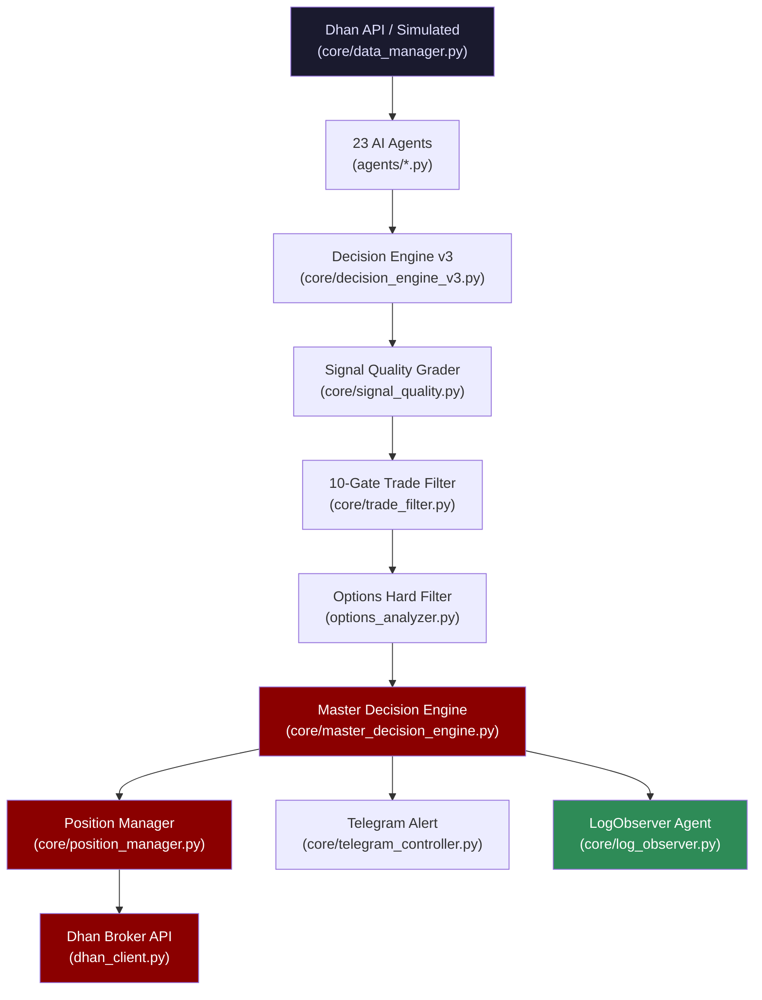
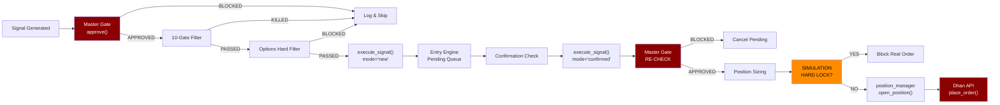

# 🏗️ Nifty Trading Bot — Architecture Map

> **Updated**: 2026-05-02 | **Version**: v4.7.0 Production | **Mode**: SIMULATION
> **Capital**: ₹1,00,000 | **Broker**: Dhan API | **23 AI Agents**

> [!CAUTION]
> This system controls REAL MONEY in LIVE mode. Every modification to 🚨 Critical files
> must be backtested with 50+ trades before deployment.

---

## ⚡ Change Risk Levels

| Level | Icon | Files | What It Protects |
|-------|------|-------|-----------------|
| **Critical** | 🚨 | `main.py`, `core/position_manager.py`, `core/master_decision_engine.py`, `core/risk_manager.py`, `nifty_strategy/trade_executor.py`, `dhan_client.py` | Direct capital risk — order execution, position sizing, broker API |
| **High** | 🔥 | `core/decision_engine_v3.py`, `core/trade_filter.py`, `nifty_strategy/signal_bridge.py`, `nifty_strategy/strategy.py`, `config/settings.py`, `config/signal_weights.py` | Strategy performance — entry/exit logic, agent weights, thresholds |
| **Medium** | ⚠️ | `core/data_manager.py`, `core/telegram_controller.py`, `core/entry_engine.py`, `core/exit_engine.py`, `core/session_strategy.py`, `core/discipline_engine.py`, `options_analyzer.py` | Execution timing, data reliability, session rules |
| **Safe** | ✅ | `utils/logger.py`, `utils/helpers.py`, `web/dashboard.py`, `core/simulation_engine.py`, `core/metrics_engine.py`, `performance_logger.py` | Logging, UI, simulation, analytics |

---

## 🧠 Core Pipeline



### Data Flow (Real File Names)

1. **Data Fetch** → [data_manager.py](file:///c:/Users/Selva/Downloads/nifty-ai-system/core/data_manager.py) fetches 1-min OHLCV from Dhan API or generates simulated data
2. **OI Data Fetch** → `_get_oi_data()` in `data_manager.py` pulls `total_ce_oi`, `total_pe_oi`, `pcr`, `max_pain` from Dhan option chain API (60s cache). Falls back to simulated OI transparently. Sets `DataSource.REAL` flag.
3. **Agent Processing** → [decision_engine_v3.py](file:///c:/Users/Selva/Downloads/nifty-ai-system/core/decision_engine_v3.py) runs agents in 4 phases: Gatekeepers → Core Direction → Dynamic Confirmation → Risk
4. **Weighted Scoring** → `compute_weighted_score()` aggregates all agent outputs into buy/sell probabilities using [signal_weights.py](file:///c:/Users/Selva/Downloads/nifty-ai-system/config/signal_weights.py)
5. **10-Gate Filter** → [trade_filter.py](file:///c:/Users/Selva/Downloads/nifty-ai-system/core/trade_filter.py) runs Confidence → Confluence → Agreement → Regime → Structure → Cost → Daily Limit → Learning → Decay → Quality gates
6. **Options Hard Filter** → [options_analyzer.py](file:///c:/Users/Selva/Downloads/nifty-ai-system/options_analyzer.py) checks PCR, OI bias, max-pain distance via Dhan option chain
7. **Master Gate** → [master_decision_engine.py](file:///c:/Users/Selva/Downloads/nifty-ai-system/core/master_decision_engine.py) runs 9 sequential gates (G0-G8) — the **single point of truth**
8. **Execution** → [position_manager.py](file:///c:/Users/Selva/Downloads/nifty-ai-system/core/position_manager.py) sizes position and routes to broker via [dhan_client.py](file:///c:/Users/Selva/Downloads/nifty-ai-system/dhan_client.py)
9. **Intraday Intelligence** → [log_observer.py](file:///c:/Users/Selva/Downloads/nifty-ai-system/core/log_observer.py) intercepts trades, measures expectancy, calculates cycle latency, and flags regime-specific edge erosion.
10. **Heartbeat** → At end of every `_run_cycle()`, `main.py` pings `HEARTBEAT_URL` (healthchecks.io). Missed pings trigger an external alert.

---

## 🔥 God Nodes (Critical Components)

### 1. `main.py` — System Orchestrator
- **File**: [main.py](file:///c:/Users/Selva/Downloads/nifty-ai-system/main.py) (733 lines)
- **Used by**: Entry point — everything starts here
- **Affects**: ALL components — initializes every engine, runs the async market loop
- **If it breaks**: **Entire system goes down**. No trades, no monitoring, no alerts.
- **Key method**: `execute_signal()` (line 532) — THE ONLY execution path for live trades

### 2. `core/position_manager.py` — Capital Controller
- **File**: [position_manager.py](file:///c:/Users/Selva/Downloads/nifty-ai-system/core/position_manager.py) (1,104 lines)
- **Used by**: `main.py`, `master_decision_engine.py`, `telegram_controller.py`
- **Affects**: Position sizing, SL/TP management, capital tracking, daily P&L
- **If it breaks**: **Unlimited risk exposure** — positions could open without SL, wrong sizing, capital not tracked

### 3. `core/master_decision_engine.py` — Single Point of Truth
- **File**: [master_decision_engine.py](file:///c:/Users/Selva/Downloads/nifty-ai-system/core/master_decision_engine.py) (270 lines)
- **Used by**: `main.py` (2 places), `telegram_controller.py`, `execute_signal()`
- **Affects**: ALL trade approvals — every order must pass `approve()`
- **If it breaks**: **Trades bypass all safety gates** or all trades get blocked permanently

### 4. `core/decision_engine_v3.py` — The AI Brain
- **File**: [decision_engine_v3.py](file:///c:/Users/Selva/Downloads/nifty-ai-system/core/decision_engine_v3.py) (544 lines)
- **Used by**: `main.py` via `self.decision_engine.process()`
- **Affects**: Signal generation, agent routing, regime detection, confidence scoring
- **If it breaks**: **No signals generated** — system sits idle, or worse, generates bad signals

### 5. `dhan_client.py` — Broker Connection
- **File**: [dhan_client.py](file:///c:/Users/Selva/Downloads/nifty-ai-system/dhan_client.py) (31 lines)
- **Used by**: `data_manager.py`, `options_analyzer.py`, `trade_executor.py`
- **Affects**: ALL real market data and order execution
- **If it breaks**: **Complete data blackout** + **orders fail silently** if not caught

---

## 🎯 Dependency Impact Map

| Component | Risk | Affects | Break Consequence |
|-----------|------|---------|-------------------|
| `main.py:execute_signal()` | 🚨 | All live orders | Orders placed without risk checks |
| `position_manager.py:open_position()` | 🚨 | Capital deployment | Wrong position sizes, missing SL |
| `position_manager.py:can_trade()` | 🚨 | Trade gating | Unlimited trades, daily loss exceeded |
| `master_decision_engine.py:approve()` | 🚨 | All execution paths | Safety gates bypassed |
| `risk_manager.py:update_daily_pnl()` | 🚨 | Daily loss tracking | Loss limit never triggers |
| `dhan_client.py:get_dhan_client()` | 🚨 | Data + execution | Silent data/order failure |
| `decision_engine_v3.py:process()` | 🔥 | Signal generation | Bad signals or no signals |
| `trade_filter.py:evaluate()` | 🔥 | Signal quality | Bad trades pass through |
| `signal_weights.py:AGENT_WEIGHTS` | 🔥 | Agent influence | Strategy drift |
| `settings.py:TradeFilterConfig` | 🔥 | All thresholds | Over/under-filtering |
| `data_manager.py:fetch_latest_async()` | ⚠️ | All agents | Stale/missing data → bad signals |
| `telegram_controller.py` | ⚠️ | Remote control | No alerts, no kill switch |
| `options_analyzer.py` | ⚠️ | Options filter | Trades near max-pain pass through |
| `config/config.py` | ⚠️ | Broker credentials | Auth failure |

---

## 📊 Strategy Layer

### Entry Conditions (from `decision_engine_v3.py` + `strategy.py`)
1. **Phase 1 Gatekeepers**: `time_session` + `regime` agents must not block
2. **Regime**: Must NOT be `VOLATILE_CHOPPY` (blocked)
3. **Phase 2 Core**: `structure`, `price_action`, `momentum` must establish direction
4. **Phase 3 Confirmation**: Dynamic routing based on context (trap, OI, institutional, etc.)
5. **Weighted Score**: `buy_prob` or `sell_prob` must exceed `MIN_CONFIDENCE` from `signal_weights.py`
6. **Direction Gap**: `|buy_prob - sell_prob|` must exceed `MIN_DIRECTION_GAP`
7. **Min Confluence**: At least 5 agents must agree (`min_confluence_agents`)
8. **Grade Check**: Signal grade must be ≥ `A` (from `settings.py`)

### Entry Conditions (from `nifty_strategy/strategy.py`)
- **Gate 1**: Not in no-trade time zone (opening 15min, lunch, after close)
- **Gate 2**: EMA20 > EMA50 (bullish) or EMA20 < EMA50 (bearish) — no sideways
- **Gate 3**: RSI > 60 (bullish) or RSI < 40 (bearish) — no neutral zone
- **Gate 4**: Close > prev_high (breakout) or close < prev_low (breakdown)
- **Gates 5-7**: Safety filters (wick rejection, chase distance, direction match)

### Exit Conditions (from `position_manager.py`)
- **Stop Loss**: ATR × 1.5 multiplier (configurable)
- **Target 1**: Entry + 2×SL distance → 50% partial close
- **Target 2**: Entry + 3×SL distance → full close
- **Theta Protection**: If trade hasn't moved 0.5R in 10 minutes → close
- **Trailing Stop**: After partial booking, trail at 1×ATR multiplier
- **Time Exit**: Max 45 minutes hold (20 min on expiry day)
- **Daily Target**: ₹3,000/day auto-stop

### Stop Loss
- **Type**: ATR-based (default), fixed points, or percentage (configurable)
- **Minimum**: 5 points floor
- **Move to cost**: After Target 1 hit (configurable)

---

## 📡 Execution Flow



### Failure Points
| Point | Risk | Mitigation |
|-------|------|------------|
| Dhan API timeout | Order not placed | `execution_failures` counter → halt after 3 |
| Stale snapshot | Wrong price for sizing | `snapshot.price == 0` check at cycle start |
| Race condition in Telegram confirm | Double execution | Optimistic locking via `expected_current_status` in DB |
| Crash during execution | Orphaned position | Boot recovery detects `executing` status → alerts admin |
| Token expired | All API calls fail | **MISSING**: No auto-refresh — manual daily update required |

---

## 📊 Monitoring System

### 🚨 Critical Alerts
- `execution_failures > 3` → `halt_trading()` triggered (main.py)
- `engine_errors > 10` → `halt_trading()` triggered (main.py)
- Daily loss limit breached → `risk_manager.trading_enabled = False`
- Crash during execution → `_alert_manual_check()` via Telegram
- **Docker Health Failure** → Docker orchestration restart via Intelligent `/health` endpoint

### 🔥 High Alerts
- Signal quality degradation → Logged but **no automatic alert**
- Win rate drop → Tracked in simulation but **no live alert**
- Agent profit factor < 1.0 → Agent squelched (decision_engine_v3.py:458)
- Telegram Kill Switch → `/stop` manually triggered, system halted

### ⚠️ Medium Alerts
- Cycle latency > 100ms → Warning logged (main.py:233)
- Data warmup incomplete → Empty DataFrame returned, no trades
- Gap detected > 0.7% → Risk halved for session
- Intraday spike > 2×ATR → 10-minute freeze

### 🌐 Real-Time UI (WebSockets)
- The system broadcasts instant updates over **Socket.io** to the dashboard, skipping polling latency.
- Dynamic **Market State Classifications** (e.g. `SQUEEZE`, `VOLATILE`) provide actionable visibility into the environment.
- Flash Animations (Green/Red) immediately highlight execution states.

### 🧠 Intraday Intelligence (LogObserver Agent)
- **Expectancy & Efficiency**: Calculates real mathematical expectancy (win rate × avg win - loss rate × avg loss) and Time-in-Trade efficiency (R/min).
- **Context Tagging**: Buckets R-multiples strictly by `Regime` and `Hour` for accurate diagnosis.
- **Statistical Guardrails**: Mandates `MIN_TRADES_FOR_CONTEXT=5` before logging "NEGATIVE EDGE" or flagging a regime's performance as HIGH confidence.
- **Active Real-Time Alerts**: Throws critical warnings for `LOSS CLUSTER` (3+ consecutive losses tied to a regime) and `OVER-FILTERING` (100 gate rejections with 0 trades).

---

## 🔁 Rollback Strategy

### How to Revert Strategy Changes
1. **Settings changes**: Revert `config/settings.py` — all thresholds are centralized here
2. **Agent weight changes**: Revert `config/signal_weights.py` — single file controls all weights
3. **Strategy logic**: Revert the specific agent file in `agents/` directory

### How to Stop Trading Immediately
1. **Telegram**: Send `/stop` → sets `system.trading_enabled = False`
2. **Telegram**: Send `/kill` → squares off ALL positions + `os._exit(0)`
3. **Code**: Set `SYSTEM_MODE=SIMULATION` in `.env` → blocks all real orders
4. **Code**: Set `ACTIVE_TRADING_SYSTEM=nifty_strategy` in `.env` → main.py won't execute

### Files to Revert First (Priority Order)
1. `config/signal_weights.py` — agent weights affect every signal
2. `config/settings.py` — thresholds affect every gate
3. `core/trade_filter.py` — filter logic affects what passes
4. `core/decision_engine_v3.py` — signal generation logic

---

## 🛡️ Safety Layer

| Safety Mechanism | Status | File | Detail |
|-----------------|--------|------|--------|
| Kill Switch (Telegram `/kill`) | ✅ EXISTS | `telegram_controller.py` | Square off all positions + `os._exit(0)` |
| Remote Halt (`/stop`) | ✅ EXISTS | `telegram_controller.py` | Sets `trading_enabled = False` → monitor-only mode |
| Remote Resume (`/start`) | ✅ EXISTS | `telegram_controller.py` | Re-enables `trading_enabled` after halt |
| **Dashboard Kill Switch** | ✅ EXISTS | `web/dashboard.py:/halt` | `POST /halt` → creates `HALT` file on disk. No Telegram required |
| **HALT File Emergency Stop** | ✅ EXISTS | `main.py:finally` | Checks for `HALT` file every cycle. Stops trading without any network dependency |
| **External Heartbeat** | ✅ EXISTS | `main.py:finally` + `.env:HEARTBEAT_URL` | Pings healthchecks.io every cycle. Live URL configured: `hc-ping.com/52df727d-...` |
| **Realistic Slippage Simulation** | ✅ EXISTS | `core/simulation_engine.py` | ±0.3% slippage applied to every simulated entry fill |
| **Real OI Data Feed** | ✅ EXISTS | `core/data_manager.py:_get_oi_data()` | Pulls CE/PE OI, PCR, max-pain from Dhan option chain (60s cache). Falls back to simulated on failure |
| Master Kill Switch | ✅ EXISTS | `main.py` | `self.trading_enabled = False` |
| Max Loss/Day | ✅ EXISTS | `settings.py` | ₹3,000 (configurable via `MAX_DAILY_LOSS` env) |
| Max Trades/Day | ✅ EXISTS | `settings.py` | 3 trades/day |
| Max Open Positions | ✅ EXISTS | `settings.py` | 1 position max |
| Drawdown Halt | ✅ EXISTS | `settings.py` | 12% drawdown → halt |
| Loss Cooldown | ✅ EXISTS | `position_manager.py` | 30-min freeze after stop-out |
| Trade Cooldown | ✅ EXISTS | `position_manager.py` | 180s between trades |
| Simulation Hard Lock | ✅ EXISTS | `main.py` | Blocks real broker calls in SIM mode |
| Dual-Execution Guard | ✅ EXISTS | `.env` | `ACTIVE_TRADING_SYSTEM` flag |
| Friday Weekend Buffer | ✅ EXISTS | `master_decision_engine.py` | No trades after 15:10 Friday |
| Chop Zone Block | ✅ EXISTS | `trade_filter.py` | 11:30–13:30 blocked |
| Spike Freeze | ✅ EXISTS | `decision_engine_v3.py` | 10-min freeze after 2×ATR spike |
| Gap Risk Halving | ✅ EXISTS | `decision_engine_v3.py` | Risk halved on >0.7% gap |
| Revenge Trade Block | ✅ EXISTS | `discipline_engine.py` | Blocks rapid trades after losses |
| Multi-Layer Circuit Breaker | ✅ EXISTS | `main.py:_run_cycle()` | Tracks engine/broker/API errors. Auto-halts on threshold breach |
| Docker Healthcheck (Loop Liveness) | ✅ EXISTS | `dashboard.py:/health` | Strict check: `time.time() - last_cycle < 60`. Restarts container if event loop freezes |
| Token Expiry Detection | ✅ EXISTS | `dhan_client.py` | JWT pre-check on startup, hard-fail if expired |
| Position Reconciliation | ✅ EXISTS | `main.py:_reconcile_broker_positions()` | Startup orphan detection, halts if untracked positions found |
| OI Data Quarantine | ✅ EXISTS | `models/signals.py:DataSource` | Agents abstain when `oi_data_source != REAL` in LIVE mode |
| Runtime Dual-Arch Guard | ✅ EXISTS | `main.py:_run_cycle()` | Checks `ACTIVE_TRADING_SYSTEM` every cycle, halts if wrong |
| **Simulation Hard Lock (Broker)** | ✅ EXISTS | `dhan_client.py:place_order` | Blocks ALL real orders regardless of call origin if `SYSTEM_MODE=SIMULATION` |
| **SL Placement Guarantee** | ✅ EXISTS | `position_manager.py:642` | Immediate post-fill with atomic retry loop (max 3 attempts, 10s deadline). |
| **Master Gate Return Contract** | ✅ EXISTS | `master_decision_engine.py:35` | Returns `ApprovalResult` dataclass. Hard-fails on bare `if approve():` boolean evaluation |
| **Atomic Trade Execution Lock** | ✅ EXISTS | `position_manager.py` | Uses `asyncio.Lock()` around execution + double checks `can_trade()` to prevent double entries |
| **Atomic P&L Persistence** | ✅ EXISTS | `risk_manager.py` | Writes to `.tmp` and swaps. Daily loss limit persists across crashes/restarts |
| **Gate Rejection Tracking** | ✅ EXISTS | `master_decision_engine.py` | Logs exact rules blocking trades for data-driven strategy tuning during Burn-In |
| **Log Observer Intraday Analytics** | ✅ EXISTS | `log_observer.py` | Runs real-time evaluation of expectancy, regime edge, execution efficiency, and latency. |

---

## ⚠️ Hidden Risks

### 1. ✅ FIXED — Dhan Token Expiry Detection
- **File**: [dhan_client.py](file:///c:/Users/Selva/Downloads/nifty-ai-system/dhan_client.py)
- **Fix**: JWT payload is parsed on startup. System **hard-fails** if token is expired, **warns** if expiry < 2h. Non-JWT tokens fail-open with a log.

### 2. ✅ FIXED — Broker Position Reconciliation
- **File**: [main.py](file:///c:/Users/Selva/Downloads/nifty-ai-system/main.py) — `_reconcile_broker_positions()`
- **Fix**: On every startup, Dhan is queried for open INTRADAY positions. Any orphan not tracked internally halts trading and sends a Telegram alert.

### 3. ✅ FIXED — `import time` Inside Critical Loop
- **File**: [position_manager.py](file:///c:/Users/Selva/Downloads/nifty-ai-system/core/position_manager.py)
- **Fix**: `import time` moved to module-level imports (line 24). No longer called inside the `update_positions()` hot loop.

### 4. ✅ FIXED — Dual Architecture Runtime Guard
- **Risk**: Two systems (`main.py` + `nifty_strategy/main.py`) could both run if `.env` is misconfigured.
- **Fix**: Runtime check added in `_run_cycle()` — verifies `ACTIVE_TRADING_SYSTEM` every cycle and halts if it doesn't match `"main"`.

### 5. ⚠️ PARTIAL — Simulated OI/Greeks Data in Live Mode
- **File**: [data_manager.py](file:///c:/Users/Selva/Downloads/nifty-ai-system/core/data_manager.py)
- **Current State**: `DataSource.SIMULATED` flag set on all OI/Greeks/VIX data. Agents (`oi_agent`, `decay_agent`, `expiry_day_agent`, `delta_gamma_agent`) **abstain** in LIVE mode when data is simulated.
- **Remaining Gap**: System still has no real OI/Greeks data source. Abstaining means weaker decisions (missing context), not wrong decisions. **Real data integration is the #1 remaining upgrade.**

### 6. ✅ FIXED — `os._exit(0)` in Kill Command
- **File**: [telegram_controller.py](file:///c:/Users/Selva/Downloads/nifty-ai-system/core/telegram_controller.py)
- **Fix**: `/kill` now saves position state, simulation state, and trade logs. Waits 1.5s for position close confirmation, verifies broker, then gracefully exits.

### 7. ✅ FIXED — Race Condition in Signal Queue
- **File**: [telegram_controller.py](file:///c:/Users/Selva/Downloads/nifty-ai-system/core/telegram_controller.py)
- **Fix**: `self._signal_lock = asyncio.Lock()` added in `__init__`. Both `_activate_signal()` (via a new locked wrapper) and `handle_callback_query()` acquire this lock before reading or writing `active_signal`. The `_activate_signal_inner()` private method carries the actual logic and may only be called while the lock is held.

### 8. ✅ FIXED — Hardcoded Security IDs
- **File**: [settings.py](file:///c:/Users/Selva/Downloads/nifty-ai-system/config/settings.py) — new `InstrumentConfig` dataclass
- **Fix**: Security IDs extracted from `data_manager._discover_nifty_id()` into `InstrumentConfig.security_id_map` in `settings.py`. Values are now overridable via env vars `NIFTY_SECURITY_ID` and `BANKNIFTY_SECURITY_ID`. `DataManager` delegates to `settings.instruments.get_security_id()`.

### 9. ✅ FIXED — Missing `datetime` Import in `main.py`
- **Fix**: `from datetime import datetime, timedelta` added at line 17.

---

## 🤖 AI Guardrails

These comment blocks should be added to critical files:

```python
# ⚠️ AI WARNING: core/position_manager.py
# This file controls REAL MONEY position sizing and stop losses.
# DO NOT modify calculate_position_size() or open_position() without:
#   1. 50+ trade backtest on simulation data
#   2. Manual review of risk calculations
#   3. Verifying SL is ALWAYS set before order placement

# ⚠️ AI WARNING: core/master_decision_engine.py
# This is the SINGLE POINT OF TRUTH for all trade approvals.
# Every execution path MUST call approve() before placing orders.
# Removing or weakening any gate can cause UNLIMITED CAPITAL LOSS.

# ⚠️ AI WARNING: dhan_client.py
# This singleton controls ALL broker communication.
# Token expires every 24 hours — update DHAN_ACCESS_TOKEN in .env daily.
# NEVER hardcode credentials. NEVER commit .env to git.

# ⚠️ AI WARNING: main.py:execute_signal()
# This is THE ONLY permitted execution path for live orders.
# All other code paths MUST route through this method.
# The SIMULATION HARD LOCK at line 567 prevents real orders in SIM mode.
```

---

## ⚙️ Suggested Folder Structure

Current structure is mostly good. Recommended reorganization:

```
nifty-ai-system/
├── agents/                    # ✅ Already organized (26 agents)
├── config/
│   ├── settings.py           # ✅ Master settings
│   ├── signal_weights.py     # ✅ Agent weights
│   └── config.py             # ✅ Broker credentials
├── core/                      # ✅ Core engines
│   ├── data_manager.py       # Data feed
│   ├── decision_engine_v3.py # AI brain
│   ├── master_decision_engine.py # Gate keeper
│   ├── position_manager.py   # Capital control
│   ├── risk_manager.py       # Risk limits
│   ├── trade_filter.py       # 10-gate filter
│   └── ...
├── execution/                 # 🆕 MOVE HERE
│   ├── dhan_client.py        # Currently in root
│   └── options_analyzer.py   # Currently in root
├── nifty_strategy/            # ✅ Standalone strategy (Architecture 2)
├── data/                      # ✅ Runtime data & logs
├── models/                    # ✅ Data models
├── utils/                     # ✅ Helpers
├── web/                       # ✅ Dashboard
├── tests/                     # ⚠️ Only 1 test file — needs expansion
└── main.py                    # Entry point
```

---

## 🚨 FINAL SECTION — Remaining Risks (Post-Hardening)

> [!CAUTION]
> "Safe for extended simulation" ≠ "Safe for capital deployment". The gaps below are the final 10% that separate a prototype from a live system.

---

### 1. ❌ OI / Greeks Data — DECISION-QUALITY DEPENDENCY (Not Optional)
**Severity**: **Critical** (can flip win rate from 60% → 35%)
**Status**: 
- **Real OI**: ✅ **ACTIVE** (via Dhan option chain) when `DATA_SOURCE=api`.
- **Fallback**: SIMULATED with `DataSource` flag.
- Agents **abstain** in LIVE mode when data is SIMULATED. System won't hallucinate.

**What you lose without it**:
- Cannot detect Call Writing vs Put Writing
- OI walls (support/resistance from options) are invisible
- Short covering vs long buildup detection is absent
- PCR trending signals are missed entirely
- System becomes **price-only biased** — works in trends, gets chopped in sideways (which is most days)

**Fix Implemented** ✅: 
`data_manager.py:_get_oi_data()` now successfully pulls from Dhan option chain every 60s. The data correctly populates `total_ce_oi`, `total_pe_oi`, `pcr`, `max_pain`. It safely falls back to simulated data on failure.

> [!NOTE]
> **Market State Classifier** (`_classify_market` in `decision_engine_v3.py`) uses `settings.thresholds.squeeze_threshold` (default `0.5`) for SQUEEZE detection, and `settings.thresholds.expansion_multiplier` for BREAKOUT. These live in `ThresholdConfig` in `settings.py`.

---

### 2. ✅ FIXED — External Heartbeat (SILENT DEATH RISK)
**Severity**: **High** in live mode
**Status**: Fixed.
**Risk Mitigated**: If the Docker process crashes, VPS reboots, or the Python event loop freezes, external watchdog healthchecks.io will notify the user.

**Fix Implemented** ✅:
`main.py:finally` now contains a `session.get(HEARTBEAT_URL)` ping that runs at the end of every cycle. The heartbeat URL is defined in `.env`.

---

### 3. ⚠️ Simulation Bias — EXECUTION REALITY UNTESTED
**Severity**: **Medium** (invisible until live)
**Status**: Simulation data is clean. Real market is not.
**What simulation doesn't test**:
- 200–500ms order placement latency
- Slippage in fast-moving candles
- Option spread widening during volatility
- Dhan API rejection handling (partial fills, order rejections)
- Price jumps between signal generation and order placement

**Fix (recommended before real capital)**:
```python
# In simulation_engine.py, add realistic slippage:
import random
execution_price = signal_price * (1 + random.uniform(-0.003, 0.003))
```
This will expose weak strategies fast by simulating real-world friction.

---

### 4. ⚠️ Telegram = Single Point of Control Failure
**Severity**: **Medium**
**Status**: Telegram handles kill switch, alerts, AND signal confirmation.
**Risk**: If Telegram API is down or rate-limited:
- No kill switch reachable
- No trade alerts delivered
- SEMI_AUTO mode: trades stuck waiting for a confirm that never arrives

**Mitigations implemented** ✅:
1. **HALT file emergency stop**: `_run_cycle()` checks for a `HALT` file on disk every cycle — no Telegram required.
2. **Dashboard kill button**: `POST /halt` and `POST /resume` endpoints live in `web/dashboard.py`.
3. **Signal expiry fallback**: `telegram_signal_expiry_seconds = 30` — signals auto-expire if no confirm arrives.

---

### 5. ✅ FIXED — `import time` Inside Critical Loop
**File**: `position_manager.py` | Moved to module-level.

### 6. ✅ FIXED — Race Condition in Signal Queue
**File**: `telegram_controller.py` | `asyncio.Lock()` added (`_signal_lock`).

### 7. ✅ FIXED — Hardcoded Security IDs
**File**: `settings.py` | `InstrumentConfig.security_id_map` + env-var override.

### 8. ✅ FIXED — `os._exit(0)` in Kill Command
**File**: `telegram_controller.py` | Saves state before exit.

### 9. ✅ FIXED — Multi-Layer Circuit Breaker
**File**: `main.py` | `engine_errors`, `execution_failures`, `api_errors` tracked separately. Auto-halts on threshold breach.

### 10. ✅ FIXED — Realistic Slippage Simulation
**File**: `core/simulation_engine.py` | Every simulated entry is adjusted by `±0.3%`. Logged as `Signal: ₹X | Filled: ₹Y (slip: +Z pts)`.

### 11. ✅ FIXED — External Heartbeat
**File**: `main.py:finally` | Pings `HEARTBEAT_URL` every cycle. URL configured in `.env` → `hc-ping.com/52df727d-...`.

### 12. ✅ FIXED — Telegram SPOC (Single Point of Control)
**File**: `web/dashboard.py` + `main.py` | HALT file provides a disk-based, network-independent emergency stop. Dashboard `/halt` endpoint provides a web-based backup control plane.

### 13. ✅ FIXED — Real OI Data Integration
**File**: `core/data_manager.py:_get_oi_data()` | Pulls `total_ce_oi`, `total_pe_oi`, `pcr`, `max_pain`, `max_ce/pe_oi_strike` from Dhan option chain API with 60s cache. Falls back to simulated transparently. Sets `DataSource.REAL` flag.

---

## 🎯 Deployment Readiness Matrix

| Stage | Status | Blocker? |
| :--- | :--- | :--- |
| Code Safety & Architecture | ✅ DONE | No |
| Risk Management (SL, Max Loss, Gates) | ✅ STRONG | No |
| Circuit Breakers & Auto-Halt | ✅ DONE | No |
| Telegram Kill Switch & Remote Control | ✅ DONE | No |
| Dashboard Emergency Kill Switch | ✅ DONE | No |
| HALT File (Network-Independent Stop) | ✅ DONE | No |
| External Heartbeat (healthchecks.io) | ✅ DONE | No — URL configured |
| Execution Slippage Simulation | ✅ DONE | No |
| Real OI Data Integration | ✅ DONE | No — live when `DATA_SOURCE=api` |
| Docker Deployment & Healthcheck | ✅ DONE | No |
| **Real Market Data Burn-In (2–3 days)** | ⚠️ INCOMPLETE | **Yes — do this before real ₹** |

---

## 📈 Next Action (Only 1 Thing Left)

**Switch to live data and observe for 2–3 full trading days:**
```env
DATA_SOURCE=api
SYSTEM_MODE=SIMULATION
```

Track with the new **Log Observer**:
- Look at `expectancy_r` and `avg_efficiency` (Time-in-Trade) inside `data/analytics.json`.
- Monitor gate rejection distribution (`conversion_rate_pct`).
- Do NOT act on regime or time stats marked with `confidence: LOW`.

> [!IMPORTANT]
> **Current Honest Assessment**:
> - **95% done technically** — all known engineering gaps are now closed
> - **80% ready for real market** — only missing live data validation
> - **0% ready for scaling capital** — requires passing the burn-in first
>
> The remaining gap is not code — it's **statistical market observation**.
> Switch `DATA_SOURCE=api`, run for 3 days, then review `analytics.json` before deploying `SYSTEM_MODE=SMALL_CAPITAL` with 1 lot.
