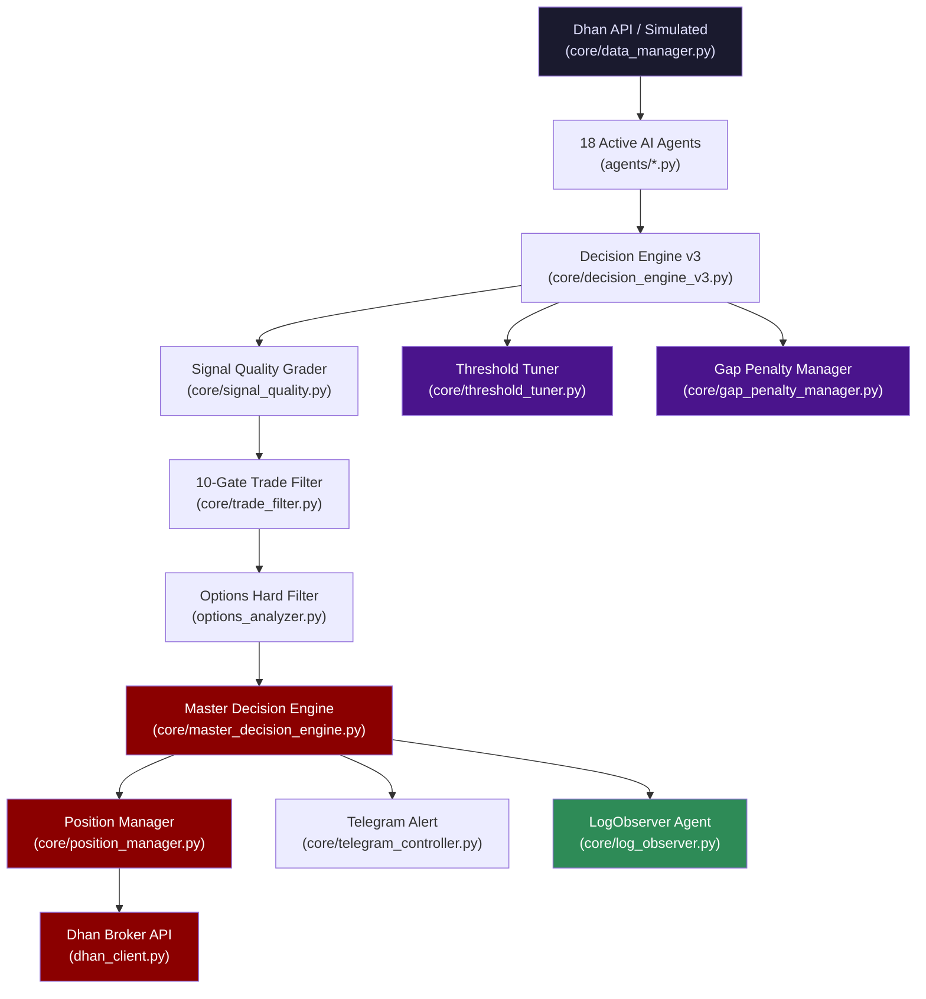
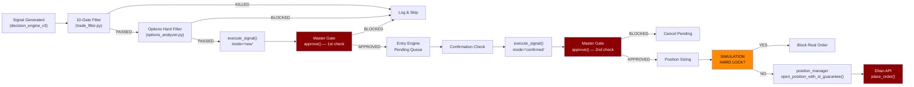

# 🏗️ Nifty Trading Bot — Architecture Map

> **Updated**: 2026-05-18 | **Version**: v4.7.0 Hybrid TSL Engine | **Mode**: SIMULATION
> **Capital**: ₹1,00,000 | **Broker**: Dhan API | **18 Active AI Agents** (24 registered in `agents/`, 5 disabled via Graphify audit + `active_agents` config list)

> [!CAUTION]
> This system controls REAL MONEY in LIVE mode. Every modification to 🚨 Critical files
> must be backtested with 50+ trades before deployment.

---

## ⚡ Change Risk Levels

| Level | Icon | Files | What It Protects |
|-------|------|-------|--------------------|
| **Critical** | 🚨 | `main.py`, `core/position_manager.py`, `core/master_decision_engine.py`, `core/risk_manager.py`, `nifty_strategy/trade_executor.py`, `dhan_client.py` | Direct capital risk — order execution, position sizing, broker API |
| **High** | 🔥 | `core/decision_engine_v3.py`, `core/trade_filter.py`, `core/gap_penalty_manager.py`, `core/threshold_tuner.py`, `nifty_strategy/signal_bridge.py`, `nifty_strategy/strategy.py`, `config/settings.py`, `config/signal_weights.py` | Strategy performance — entry/exit logic, agent weights, thresholds, penalty models |
| **Medium** | ⚠️ | `core/data_manager.py`, `core/telegram_controller.py`, `core/entry_engine.py`, `core/exit_engine.py`, `core/session_strategy.py`, `core/discipline_engine.py`, `core/slippage_model.py`, `options_analyzer.py` | Execution timing, data reliability, session rules, cost modeling |
| **Safe** | ✅ | `utils/logger.py`, `utils/helpers.py`, `web/dashboard.py`, `core/simulation_engine.py`, `core/metrics_engine.py`, `core/log_observer.py`, `performance_logger.py`, `analyze_logs.py` | Logging, UI, simulation, analytics |

---

## 📁 Project Structure (Verified 2026-05-10)

```
nifty-ai-system/                       # Root (1,120 lines main.py)
├── agents/                            # 26 agent files (24 agents + base_agent.py + __init__.py)
│   │                                  # learning_agent_v2.py is a MIXIN dependency (not standalone)
│   ├── base_agent.py                  # 137 lines — abstract base class
│   ├── regime_agent.py                # 420 lines — market regime detection
│   ├── structure_agent.py             # 629 lines — BOS/CHoCH/FVG/OB analysis
│   ├── price_action_agent.py          # 359 lines — candlestick patterns
│   ├── learning_agent.py              # 1,077 lines — adaptive pattern learning
│   ├── momentum_agent.py              # 191 lines — RSI/MACD momentum
│   └── ... (18 more agents)
├── config/                            # 3 config files
│   ├── settings.py                    # 821 lines — master settings (v3.2)
│   ├── signal_weights.py              # 63 lines — agent weight registry
│   └── config.py                      # 50 lines — broker credentials
├── core/                              # 28 engine files
│   ├── decision_engine_v3.py          # 945 lines — AI brain (phase routing)
│   ├── position_manager.py            # ~1,646 lines — capital controller (with Hybrid TSL)
│   ├── options_resolver.py            # Phase A — Option Strike/Instrument Builder
│   ├── master_decision_engine.py      # 302 lines — single point of truth
│   ├── simulation_engine.py           # 905 lines — paper trading
│   ├── telegram_controller.py         # 580 lines — remote control
│   ├── data_manager.py               # 716 lines — market data feed
│   ├── threshold_tuner.py            # 508 lines — self-tuning thresholds
│   ├── trade_filter.py               # 431 lines — 10-gate filter
│   ├── slippage_model.py             # 378 lines — cost/slippage modeling
│   ├── gap_penalty_manager.py        # 218 lines — ATR-normalised gap decay
│   ├── log_observer.py               # 199 lines — intraday intelligence
│   ├── system_fingerprint.py         # 98 lines — runtime state snapshot for replay
│   └── ... (16 more core modules)
├── models/                            # Data models
│   ├── signals.py                     # 456 lines — Signal, MarketSnapshot, enums
│   └── trade_record.py               # 66 lines
├── nifty_strategy/                    # Architecture 2 (standalone strategy)
│   ├── signal_bridge.py              # 742 lines
│   ├── strategy.py                   # 522 lines
│   ├── paper_trader.py               # 447 lines
│   └── ... (8 more files)
├── utils/                             # Helpers & indicators
│   ├── indicators.py                 # 336 lines — TA indicator library
│   └── ... (6 more files)
├── web/
│   └── dashboard.py                  # 433 lines — Flask+SocketIO dashboard
├── tests/                             # 6 test files
├── scripts/
│   └── preflight.py                  # 110 lines — pre-deployment checks
├── data/                              # Runtime: logs, DB, state files
├── dhan_client.py                    # 197 lines — broker singleton (sim-guarded)
├── options_analyzer.py               # 308 lines — OI/PCR/max-pain filter
├── main.py                           # 1,120 lines — system orchestrator
├── Dockerfile                        # Python 3.11-slim, IST timezone
└── docker-compose.yml                # Healthcheck, volume mounts, restart:always
```

**Total Python lines**: ~20,000+ across 95 files.

---

## 🧠 Core Pipeline



### Data Flow (Real File Names)

1. **Data Fetch** → [data_manager.py](file:///c:/Users/Selva/Downloads/nifty-ai-system/core/data_manager.py) (716 lines) fetches 1-min OHLCV from Dhan API or generates simulated data
2. **OI Data Fetch** → `_get_oi_data()` in `data_manager.py` pulls `total_ce_oi`, `total_pe_oi`, `pcr`, `max_pain` from Dhan option chain API (60s cache). Falls back to simulated OI transparently. Sets `DataSource.REAL` flag.
3. **Agent Processing** → [decision_engine_v3.py](file:///c:/Users/Selva/Downloads/nifty-ai-system/core/decision_engine_v3.py) (945 lines) runs agents in 4 phases: Gatekeepers → Core Direction → Dynamic Confirmation → Risk
4. **Gap Penalty** → [gap_penalty_manager.py](file:///c:/Users/Selva/Downloads/nifty-ai-system/core/gap_penalty_manager.py) (218 lines) computes ATR-normalised, time-decaying gap penalty (replaces old binary flag)
5. **Unified Uncertainty** → Engine merges gap penalty + regime confidence into ONE multiplier (`min(gap_mult, regime_mult)`) — eliminates double-counting
6. **Sigmoid Normalization** → Post-penalty scores pass through `_sigmoid_normalize()` to restore distribution spread before grading
7. **Weighted Scoring** → `compute_weighted_score()` aggregates agent outputs with reliability multipliers using [signal_weights.py](file:///c:/Users/Selva/Downloads/nifty-ai-system/config/signal_weights.py)
8. **10-Gate Filter** → [trade_filter.py](file:///c:/Users/Selva/Downloads/nifty-ai-system/core/trade_filter.py) (431 lines) runs Confidence → Confluence → Agreement → Regime → Structure → Cost → Daily Limit → Learning → Decay → Quality gates
9. **Options Hard Filter** → [options_analyzer.py](file:///c:/Users/Selva/Downloads/nifty-ai-system/options_analyzer.py) (308 lines) checks PCR, OI bias, max-pain distance via Dhan option chain
10. **Master Gate** → [master_decision_engine.py](file:///c:/Users/Selva/Downloads/nifty-ai-system/core/master_decision_engine.py) (302 lines) runs 9 sequential gates (G0-G8) — the **single point of truth**
11. **Self-Tuning** → [threshold_tuner.py](file:///c:/Users/Selva/Downloads/nifty-ai-system/core/threshold_tuner.py) (508 lines) adjusts MIN_GAP and MIN_CONFIDENCE via split-control feedback loops with oscillation guards
12. **Execution** → [position_manager.py](file:///c:/Users/Selva/Downloads/nifty-ai-system/core/position_manager.py) (1,481 lines) sizes position and routes to broker via [dhan_client.py](file:///c:/Users/Selva/Downloads/nifty-ai-system/dhan_client.py) (197 lines)
13. **Intraday Intelligence** → [log_observer.py](file:///c:/Users/Selva/Downloads/nifty-ai-system/core/log_observer.py) (199 lines) intercepts trades, measures expectancy, calculates cycle latency, and flags regime-specific edge erosion.
14. **Heartbeat** → At end of every `_run_cycle()`, `main.py` pings `HEARTBEAT_URL` (healthchecks.io). Missed pings trigger an external alert.
15. **Deadman Watchdog** → Background `_deadman_watchdog()` task force-closes all positions if main loop stalls for >30s.

---

## 🔥 God Nodes (Critical Components)

### 1. `main.py` — System Orchestrator
- **File**: [main.py](file:///c:/Users/Selva/Downloads/nifty-ai-system/main.py) (1,120 lines)
- **Used by**: Entry point — everything starts here
- **Affects**: ALL components — initializes every engine, runs the async market loop
- **If it breaks**: **Entire system goes down**. No trades, no monitoring, no alerts.
- **Key method**: `execute_signal()` (line 658) — THE ONLY execution path for live trades
- **New in v4.6.1**: Deadman watchdog, candle-based dedup, trade frequency guard, broker reconciliation

### 2. `core/position_manager.py` — Capital Controller
- **File**: [position_manager.py](file:///c:/Users/Selva/Downloads/nifty-ai-system/core/position_manager.py) (~1,646 lines)
- **Used by**: `main.py`, `master_decision_engine.py`, `telegram_controller.py`
- **Affects**: Position sizing, SL/TP management, capital tracking, daily P&L
- **If it breaks**: **Unlimited risk exposure** — positions could open without SL, wrong sizing, capital not tracked
- **Key safety**: `open_position_with_sl_guarantee()` — atomic SL placement with retry loop

### 3. `core/master_decision_engine.py` — Single Point of Truth
- **File**: [master_decision_engine.py](file:///c:/Users/Selva/Downloads/nifty-ai-system/core/master_decision_engine.py) (302 lines)
- **Used by**: `main.py` (3 call sites), `telegram_controller.py`, `execute_signal()`
- **Affects**: ALL trade approvals — every order must pass `approve()`
- **If it breaks**: **Trades bypass all safety gates** or all trades get blocked permanently
- **Key contract**: Returns `ApprovalResult` dataclass. `__bool__` raises `TypeError` — forces `.approved` usage

### 4. `core/decision_engine_v3.py` — The AI Brain
- **File**: [decision_engine_v3.py](file:///c:/Users/Selva/Downloads/nifty-ai-system/core/decision_engine_v3.py) (945 lines)
- **Used by**: `main.py` via `self.decision_engine.process()`
- **Affects**: Signal generation, agent routing, regime detection, confidence scoring
- **If it breaks**: **No signals generated** — system sits idle, or worse, generates bad signals
- **New in v4.6.1**: Phase 1 latency cache (regime/structure), early kill-switch, opening gap session guard, unified uncertainty factor, sigmoid normalization, agent reliability multipliers, self-tuning thresholds

### 5. `dhan_client.py` — Broker Connection
- **File**: [dhan_client.py](file:///c:/Users/Selva/Downloads/nifty-ai-system/dhan_client.py) (197 lines)
- **Used by**: `data_manager.py`, `options_analyzer.py`, `trade_executor.py`
- **Affects**: ALL real market data and order execution
- **If it breaks**: **Complete data blackout** + **orders fail silently** if not caught
- **Safety**: `_SimulationGuardedClient` wraps all order methods — blocks `place_order()` in SIM mode with full stack trace

---

## 🤖 Agent Architecture (18 Active / 23 Registered)

### Phase 1: Gatekeepers (Fast & Cheap)
| Agent | Lines | Role | Cache TTL |
|-------|-------|------|-----------|
| `time_session` | 177 | Block no-trade time zones | — |
| `regime` | 420 | Detect market regime (TRENDING/RANGING/VOLATILE/SQUEEZE/BREAKOUT) | 60s |

### Phase 2: Core Direction (The Strategists)
| Agent | Lines | Role | Reliability |
|-------|-------|------|-------------|
| `structure` | 629 | BOS, CHoCH, FVGs, Order Blocks (ICT concepts) | 1.30 |
| `price_action` | 359 | Candlestick patterns, engulfing, pin bars | 1.25 |
| `momentum` | 191 | RSI, MACD, momentum divergence | 1.10 |

### Phase 3: Dynamic Confirmation (Context-Routed)
| Agent | Lines | Role | Reliability |
|-------|-------|------|-------------|
| `trap` | 264 | Bull/bear trap detection | 0.80 |
| `oi` | 205 | Open Interest analysis (real via Dhan) | 0.75 |
| `order_flow` | 82 | Bid-ask imbalance, large orders | 0.70 |
| `level` | 105 | Support/resistance, pivot levels | 1.05 |
| `institutional` | 86 | FII/DII flow analysis | 0.70 |
| `multi_timeframe` | 187 | 1m/5m/15m alignment | 1.40 |
| `volatility` | 193 | VIX, Bollinger, ATR analysis | 0.90 |

### Phase 4: Risk & Meta-Analysis
| Agent | Lines | Role | Reliability |
|-------|-------|------|-------------|
| `risk` | 238 | Position sizing, risk limits | 1.00 |
| `decay` | 215 | Theta/IV decay modeling | 0.90 |
| `expiry_day` | 300 | Expiry-day gamma/pin risk | 0.90 |
| `learning` | 1,077 | Pattern learning, confidence calibration | 1.00 |
| `market` | 164 | General market conditions | 0.80 |
| `sentiment` | 129 | Market sentiment scoring | 0.65 |

### Disabled Agents (Graphify Audit — 2026-04-09)
`consolidation`, `correlation`, `delta_gamma`, `expiry`, `gap` — confirmed unused in execution paths.

**Suppression Mechanism** (3 layers of protection):
1. **Config allowlist**: Only agents in `active_agents` list (`config/settings.py:EnginePipelineConfig`, line 643) are instantiated by `DecisionEngineV3.__init__()`. Agents not listed are **never constructed** — zero CPU.
2. **Startup assertion**: `EXPECTED_ACTIVE_AGENT_COUNT = 18` fires `AssertionError` if loaded count drifts.
3. **Explicit imports**: `agents/__init__.py` uses **explicit named imports only** — no `import *`, no `os.listdir()`, no `pkgutil.iter_modules()`. This prevents accidental loading of files in the directory.

> [!NOTE]
> `learning_agent_v2.py` is NOT a standalone agent — it provides `LearningAgentV2Mixin`, which is imported by `learning_agent.py` (line 28). It **cannot** be moved or deleted without breaking the active `LearningAgent`. Despite its name, it's an active mixin dependency, not a legacy file. The active `learning_agent.py` (1,077 lines) is the largest agent; its `learning_overfit_threshold=0.85` and `learning_staleness_days=14` guard against overfitting, but this should be monitored during burn-in.

The ~40% compute savings claim is estimated based on 5/23 agents skipped × average agent latency. Validated during v4.6.1 profiling — total cycle time dropped from ~1.2s to ~0.7s with Phase 1 caching.

---

## 🎯 Dependency Impact Map

| Component | Risk | Affects | Break Consequence |
|-----------|------|---------|-------------------|
| `main.py:execute_signal()` | 🚨 | All live orders | Orders placed without risk checks |
| `position_manager.py:open_position_with_sl_guarantee()` | 🚨 | Capital deployment | Wrong position sizes, missing SL |
| `position_manager.py:can_trade()` | 🚨 | Trade gating | Unlimited trades, daily loss exceeded |
| `master_decision_engine.py:approve()` | 🚨 | All execution paths | Safety gates bypassed |
| `risk_manager.py:update_daily_pnl()` | 🚨 | Daily loss tracking | Loss limit never triggers |
| `dhan_client.py:get_dhan_client()` | 🚨 | Data + execution | Silent data/order failure |
| `decision_engine_v3.py:process()` | 🔥 | Signal generation | Bad signals or no signals |
| `gap_penalty_manager.py:get_unified_penalty_multiplier()` | 🔥 | Score scaling | Over/under-penalizing gap days |
| `threshold_tuner.py:get_thresholds()` | 🔥 | MIN_GAP + MIN_CONF | Strategy drift if tuner oscillates |
| `trade_filter.py:evaluate()` | 🔥 | Signal quality | Bad trades pass through |
| `signal_weights.py:AGENT_WEIGHTS` | 🔥 | Agent influence | Strategy drift |
| `settings.py:TradeFilterConfig` | 🔥 | All thresholds | Over/under-filtering |
| `data_manager.py:fetch_latest_async()` | ⚠️ | All agents | Stale/missing data → bad signals |
| `telegram_controller.py` | ⚠️ | Remote control | No alerts, no kill switch |
| `options_analyzer.py` | ⚠️ | Options filter | Trades near max-pain pass through |
| `config/config.py` | ⚠️ | Broker credentials | Auth failure |

---

## 📊 Strategy Layer

### Entry Conditions (from `decision_engine_v3.py`)
1. **Phase 1 Gatekeepers**: `time_session` + `regime` agents must not block
2. **Regime**: Must NOT be `VOLATILE_CHOPPY` (blocked)
3. **Phase 2 Core**: `structure`, `price_action`, `momentum` must establish direction
4. **Early Kill-Switch**: Pre-Phase 3 dominant score must exceed 0.35 (saves 25-40% latency on bad setups)
5. **Phase 3 Dynamic Routing**: Context-aware agent selection (opening gap suppression, memory-aware, timeframe-throttled)
6. **Unified Uncertainty**: `min(gap_mult, regime_mult)` — single penalty, not compounded
7. **Sigmoid Normalization**: Restores score distribution spread after multiplicative penalties
8. **Adaptive Thresholds**: `ThresholdTuner` adjusts MIN_GAP and MIN_CONFIDENCE based on rolling trade quality
9. **Min Confluence**: At least 3 agents must agree (`min_confluence_agents`)
10. **Grade Check**: Signal grade must be ≥ `B+` (from `settings.py`)

### Entry Conditions (from `nifty_strategy/strategy.py`)
- **Gate 1**: Not in no-trade time zone (opening 15min, lunch, after close)
- **Gate 2**: EMA20 > EMA50 (bullish) or EMA20 < EMA50 (bearish) — no sideways
- **Gate 3**: RSI > 60 (bullish) or RSI < 40 (bearish) — no neutral zone
- **Gate 4**: Close > prev_high (breakout) or close < prev_low (breakdown)
- **Gates 5-7**: Safety filters (wick rejection, chase distance, direction match)

### Exit & Trailing Stop Loss (TSL) Logic (v4.7.0)
The system uses a **Hybrid Trailing Stop Loss Engine** in `position_manager.py` (via `_compute_tsl`), eliminating fixed take-profit exits in favor of dynamic lifecycle management.

**Core Mechanisms:**
- **Ratchet-Only**: The TSL works off the *highest premium seen* since entry. It NEVER moves the stop downward.
- **Phase Milestones**:
  - `INITIAL`: Fixed SL below entry.
  - `BREAKEVEN` (at +12%): SL slides to entry cost.
  - `ACTIVE` (at +22%): Normal trailing begins.
  - `TIGHTEN_1` (at +35%) and `TIGHTEN_2` (at +50%): Trail width compresses to lock deep profits.
- **Additive Adjustments**: Adjusts the base trail width by combining `tsl_grade` and `tsl_regime` (e.g., A+ grade adds +2% width, Choppy regime deducts -2%). Hard clamps strictly enforce min (5%) and max (15%) widths.
- **Idle Tightening (Theta Protection)**: If premium sets no new highs for 15 minutes, the trail tightens by 2% automatically.
- **Exit Analytics**: Every exit reason (`SL_HIT_ACTIVE`, `SL_HIT_BREAKEVEN`, etc.) is tracked in `DailyStats` for system self-optimization.
- **Target 1**: Entry + 2×SL distance → 50% partial close
- **Target 2**: Entry + 3×SL distance → full close
- **Theta Protection**: If trade hasn't moved 0.5R in 10 minutes → close
- **Trailing Stop**: After partial booking, trail at 1×ATR multiplier
- **Time Exit**: Max 45 minutes hold (20 min on expiry day)
- **Daily Target**: ₹3,000/day auto-stop

### Stop Loss
- **Type**: ATR-based (default), fixed points, or percentage (configurable)
- **Minimum**: 5 points floor
- **Move to cost**: After Target 1 hit (configurable)

---

## 📡 Execution Flow



> [!NOTE]
> The Master Gate runs **inside** `execute_signal()` (main.py line 672), NOT before the filters.
> Actual code order: Signal → 10-Gate Filter (step 9) → Options Filter (step 11) → `execute_signal()` → Master Gate `approve()` (step 12).
> The Master Gate runs **twice**: once on initial entry (`mode="new"`) and again on confirmation (`mode="confirmed"`).

> [!WARNING]
> **Diagram/Prose Sync Discipline**: This diagram and the numbered Data Flow list (above) both describe the execution order. If you change the pipeline, update BOTH. The canonical source of truth is `main.py:_run_cycle()` steps 1-12. Verify against the code before trusting either the diagram or the prose.

### Failure Points
| Point | Risk | Mitigation |
|-------|------|------------|
| Dhan API timeout | Order not placed | `execution_failures` counter → halt after 3 |
| Stale snapshot | Wrong price for sizing | `snapshot.price == 0` check at cycle start |
| Race condition in Telegram confirm | Double execution | `asyncio.Lock()` via `_signal_lock` |
| Crash during execution | Orphaned position | Boot reconciliation detects `executing` status → alerts admin |
| Token expired | All API calls fail | JWT pre-check on startup, hard-fail if expired |
| Main loop stall | Positions unmanaged | Deadman watchdog force-closes after 30s |

---

## 📊 Monitoring System

### 🚨 Critical Alerts
- `execution_failures > 3` → `halt_trading()` triggered (main.py)
- `engine_errors > 10` → `halt_trading()` triggered (main.py)
- Daily loss limit breached → `risk_manager.trading_enabled = False`
- Crash during execution → `_alert_manual_check()` via Telegram
- **Deadman Switch** → Force-close all positions if main loop stalls >30s
- **Docker Health Failure** → Docker orchestration restart via `/health` endpoint

### 🔥 High Alerts
- Signal quality degradation → Logged but **no automatic alert**
- Win rate drop → Tracked in simulation but **no live alert**
- Agent profit factor < 1.0 → Agent squelched (decision_engine_v3.py)
- Telegram Kill Switch → `/stop` manually triggered, system halted
- **Loss Cluster** → 3+ consecutive losses in same regime triggers LogObserver critical warning

### ⚠️ Medium Alerts
- Cycle latency > 500ms → Warning logged (log_observer.py)
- Data warmup incomplete → Empty DataFrame returned, no trades
- Gap detected → ATR-normalised penalty applied, decays exponentially over 2 hours
- Intraday spike > 2×ATR + 30pts → 10-minute freeze
- **Over-Filtering** → 100+ gate rejections with 0 trades triggers LogObserver warning
- **No-Trade Streak** → Warns at 100, 300, 500+ consecutive no-signal cycles

### 🌐 Real-Time UI (WebSockets)
- The system broadcasts instant updates over **Socket.io** to the dashboard, skipping polling latency.
- Dynamic **Market State Classifications** (e.g. `SQUEEZE`, `VOLATILE`) provide actionable visibility into the environment.
- Flash Animations (Green/Red) immediately highlight execution states.

### 🧠 Intraday Intelligence (LogObserver Agent)
- **Expectancy & Efficiency**: Calculates real mathematical expectancy (win rate × avg win - loss rate × avg loss) and Time-in-Trade efficiency (R/min).
- **Context Tagging**: Buckets R-multiples strictly by `Regime` and `Hour` for accurate diagnosis.
- **Statistical Guardrails**: Mandates `MIN_TRADES_FOR_CONTEXT=5` before logging "NEGATIVE EDGE" or flagging a regime's performance as HIGH confidence.
- **Active Real-Time Alerts**: Throws critical warnings for `LOSS CLUSTER` (3+ consecutive losses tied to a regime) and `OVER-FILTERING` (100 gate rejections with 0 trades).

---

## 🔁 Rollback Strategy

### How to Revert Strategy Changes
1. **Settings changes**: Revert `config/settings.py` — all thresholds are centralized here
2. **Agent weight changes**: Revert `config/signal_weights.py` — single file controls all weights
3. **Strategy logic**: Revert the specific agent file in `agents/` directory
4. **Threshold tuner**: Delete `data/tuner_state.json` to reset adaptive thresholds to defaults

### How to Stop Trading Immediately
1. **Telegram**: Send `/stop` → sets `system.trading_enabled = False`
2. **Telegram**: Send `/kill` → squares off ALL positions + graceful exit
3. **Dashboard**: `POST /halt` → creates HALT file (no Telegram required)
4. **File**: Create `HALT` file in project root → checked every cycle
5. **Code**: Set `SYSTEM_MODE=SIMULATION` in `.env` → blocks all real orders at broker layer

> [!CAUTION]
> **Container restart window (~15-30s)**: During Docker container restart (triggered by healthcheck failure), ALL in-process protections are unavailable:
> - Dashboard `/halt` — unreachable
> - Telegram `/kill` — unreachable
> - Deadman watchdog — killed with the container
> - Event loop — dead
>
> **The ONLY surviving protection is broker-side stop-loss orders already resting at the exchange.** This is the system's true last line of defense — not software. The `open_position_with_sl_guarantee()` method in `position_manager.py` ensures SL orders are placed atomically with every entry, specifically to survive this scenario.
>
> The HALT file persists on disk and will be detected on restart, but positions are unmanaged during the gap.
6. **Code**: Set `ACTIVE_TRADING_SYSTEM=nifty_strategy` in `.env` → runtime dual-arch guard halts

### Files to Revert First (Priority Order)
1. `config/signal_weights.py` — agent weights affect every signal
2. `config/settings.py` — thresholds affect every gate
3. `core/trade_filter.py` — filter logic affects what passes

> [!TIP]
> **`nifty_strategy/`** is Architecture 2 — a standalone strategy that runs ONLY when `.env` has `ACTIVE_TRADING_SYSTEM=nifty_strategy`. It has its own signal bridge, paper trader, and risk manager. A runtime guard in `main.py:_run_cycle()` halts if `ACTIVE_TRADING_SYSTEM != "main"`. The two architectures **never run simultaneously**.
4. `core/decision_engine_v3.py` — signal generation logic
5. `data/tuner_state.json` — adaptive threshold state (**always backup before experiments**: `cp tuner_state.json tuner_state.json.bak`)

---

## 🛡️ Safety Layer

| Safety Mechanism | Status | File | Detail |
|-----------------|--------|------|--------|
| Kill Switch (Telegram `/kill`) | ✅ EXISTS | `telegram_controller.py` | Square off all positions + graceful exit with state save |
| Remote Halt (`/stop`) | ✅ EXISTS | `telegram_controller.py` | Sets `trading_enabled = False` → monitor-only mode |
| Remote Resume (`/start`) | ✅ EXISTS | `telegram_controller.py` | Re-enables `trading_enabled` after halt |
| Pause/Resume (`/pause`, `/resume`) | ✅ EXISTS | `telegram_controller.py` | Temporary pause without full halt |
| **Dashboard Kill Switch** | ✅ EXISTS | `web/dashboard.py:/halt` | `POST /halt` → creates `HALT` file on disk. No Telegram required |
| **Dashboard Resume** | ✅ EXISTS | `web/dashboard.py:/resume` | `POST /resume` → deletes `HALT` file |
| **HALT File Emergency Stop** | ✅ EXISTS | `main.py:finally` | Checks for `HALT` file every cycle. Stops trading without any network dependency |
| **External Heartbeat** | ✅ EXISTS | `main.py` + `.env:HEARTBEAT_URL` | Pings healthchecks.io every cycle. Fire-and-forget with backpressure |
| **Deadman Watchdog** | ✅ EXISTS | `main.py:_deadman_watchdog()` | Background task force-closes all positions if main loop stalls >30s |
| **Realistic Slippage Simulation** | ✅ EXISTS | `core/simulation_engine.py` | ±0.3% slippage applied to every simulated entry fill. SL/targets adjusted relative to fill price |
| **Real OI Data Feed** | ✅ EXISTS | `core/data_manager.py:_get_oi_data()` | Pulls CE/PE OI, PCR, max-pain from Dhan option chain (60s cache). Falls back to simulated on failure |
| **ATR-Normalised Gap Penalty** | ✅ EXISTS | `core/gap_penalty_manager.py` | Physics-based exponential decay. Absolute hard floor for >80pt gaps |
| **Self-Tuning Thresholds** | ✅ EXISTS | `core/threshold_tuner.py` | Split-control loops for GAP (quality) and CONF (frequency). Oscillation guard, drawdown guard, atomic persistence |
| Master Kill Switch | ✅ EXISTS | `main.py` | `self.trading_enabled = False` |
| Max Loss/Day | ✅ EXISTS | `settings.py` | ₹3,000 (configurable via `MAX_DAILY_LOSS` env) |
| Max Trades/Day | ✅ EXISTS | `settings.py` | 3 trades/day |
| Max Open Positions | ✅ EXISTS | `settings.py` | 1 position max |
| Drawdown Halt | ✅ EXISTS | `settings.py` | 12% drawdown → halt |
| Loss Cooldown | ✅ EXISTS | `position_manager.py` | 30-min freeze after stop-out |
| Trade Cooldown | ✅ EXISTS | `position_manager.py` | 180s between trades |
| Simulation Hard Lock (main) | ✅ EXISTS | `main.py` | Blocks real broker calls in SIM mode |
| **Simulation Hard Lock (broker)** | ✅ EXISTS | `dhan_client.py:_SimulationGuardedClient` | Blocks ALL real orders via `__getattr__` proxy. Full stack trace logged on attempt |
| Dual-Execution Guard | ✅ EXISTS | `.env` + `main.py` | `ACTIVE_TRADING_SYSTEM` checked every cycle at runtime |
| Friday Weekend Buffer | ✅ EXISTS | `master_decision_engine.py` | No trades after 15:10 Friday |
| Chop Zone Block | ✅ EXISTS | `trade_filter.py` | 11:30–13:30 blocked |
| Spike Freeze | ✅ EXISTS | `decision_engine_v3.py` | 10-min freeze after 2×ATR + 30pt spike |
| Revenge Trade Block | ✅ EXISTS | `discipline_engine.py` | Blocks rapid trades after losses |
| Multi-Layer Circuit Breaker | ✅ EXISTS | `main.py:_run_cycle()` | Tracks `engine_errors`, `execution_failures`, `api_errors` separately. Auto-halts on threshold breach |
| Docker Healthcheck (Loop Liveness) | ✅ EXISTS | `dashboard.py:/health` | Strict check: `time.time() - last_cycle < 60`. Restarts container if event loop freezes |
| Token Expiry Detection | ✅ EXISTS | `dhan_client.py` | JWT pre-check on startup, hard-fail if expired, warn if <2h |
| Position Reconciliation | ✅ EXISTS | `main.py:_reconcile_broker_positions()` | Startup orphan detection + SL presence verification. Halts + alerts if untracked positions found |
| OI Data Quarantine | ✅ EXISTS | `models/signals.py:DataSource` | Agents abstain when `oi_data_source != REAL` in LIVE mode |
| **SL Placement Guarantee** | ✅ EXISTS | `position_manager.py` | Immediate post-fill with atomic retry loop (max 3 attempts, 10s deadline) |
| **Master Gate Return Contract** | ✅ EXISTS | `master_decision_engine.py:35` | Returns `ApprovalResult` dataclass. `__bool__` raises `TypeError` — impossible to misuse |
| **Atomic Trade Execution Lock** | ✅ EXISTS | `position_manager.py` | Uses `asyncio.Lock()` around execution + double checks `can_trade()` to prevent double entries |
| **Atomic P&L Persistence** | ✅ EXISTS | `risk_manager.py` | Writes to `.tmp` and swaps. Daily loss limit persists across crashes/restarts |
| **Gate Rejection Tracking** | ✅ EXISTS | `master_decision_engine.py` | Logs exact rules blocking trades. Synced to LogObserver for data-driven tuning |
| **Log Observer Analytics** | ✅ EXISTS | `log_observer.py` | Real-time evaluation of expectancy, regime edge, execution efficiency, latency, and OI reliability |
| **Early Kill-Switch** | ✅ EXISTS | `decision_engine_v3.py` | Kills bad setups before Phase 3 deep validation — saves 25-40% latency |
| **Phase 1 Agent Cache** | ✅ EXISTS | `decision_engine_v3.py` | Regime (60s TTL) and Structure (30s TTL) cached to cut 300ms+ per cycle |
| **Opening Gap Session Guard** | ✅ EXISTS | `decision_engine_v3.py` | Suppresses deep validation during gap openings when indicators are contaminated |
| **Candle-Based Deduplication** | ✅ EXISTS | `main.py` | Heavy decision engine only runs on new candle timestamps, not every 1s cycle |
| **Trade Frequency Guard** | ✅ EXISTS | `main.py` | Warns at 100/300/500 consecutive no-trade cycles to detect structural lockout |
| **Stall Detection** | ✅ EXISTS | `main.py` | Logs critical warning if >30s gap between cycles |
| **Pre-Flight Check** | ✅ EXISTS | `scripts/preflight.py` | Verifies token, env, DB, imports, disk space before deployment |

---

## ⚠️ Hidden Risks

### 1. ✅ FIXED — Dhan Token Expiry Detection
- **File**: [dhan_client.py](file:///c:/Users/Selva/Downloads/nifty-ai-system/dhan_client.py)
- **Fix**: JWT payload is parsed on startup. System **hard-fails** if token is expired, **warns** if expiry < 2h. Non-JWT tokens fail-open with a log.

### 2. ✅ FIXED — Broker Position Reconciliation
- **File**: [main.py](file:///c:/Users/Selva/Downloads/nifty-ai-system/main.py) — `_reconcile_broker_positions()`
- **Fix**: On every startup, Dhan is queried for open INTRADAY positions. Any orphan not tracked internally halts trading and sends a Telegram alert. Also verifies SL presence on tracked positions.

### 3. ✅ FIXED — `import time` Inside Critical Loop
- **File**: [position_manager.py](file:///c:/Users/Selva/Downloads/nifty-ai-system/core/position_manager.py)
- **Fix**: `import time` moved to module-level imports. No longer called inside the `update_positions()` hot loop.

### 4. ✅ FIXED — Dual Architecture Runtime Guard
- **Risk**: Two systems (`main.py` + `nifty_strategy/main.py`) could both run if `.env` is misconfigured.
- **Fix**: Runtime check added in `_run_cycle()` — verifies `ACTIVE_TRADING_SYSTEM` every cycle and halts if it doesn't match `"main"`.

### 5. ✅ FIXED — Gap Penalty Over-Suppression
- **File**: [gap_penalty_manager.py](file:///c:/Users/Selva/Downloads/nifty-ai-system/core/gap_penalty_manager.py) + [decision_engine_v3.py](file:///c:/Users/Selva/Downloads/nifty-ai-system/core/decision_engine_v3.py)
- **Old**: Binary `session_gap_detected` flag suppressed signals all day.
- **New**: ATR-normalised severity tiers (MINOR→CRITICAL) with exponential decay. Penalty melts to ~4% after 2 hours. Absolute hard floor for >80pt gaps prevents ATR wash-out.

### 6. ✅ FIXED — Penalty Double-Counting
- **File**: [decision_engine_v3.py](file:///c:/Users/Selva/Downloads/nifty-ai-system/core/decision_engine_v3.py)
- **Old**: `gap_penalty × regime_lerp × PEV` — three independent multipliers compounding the same uncertainty.
- **New**: Unified uncertainty = `min(gap_mult, regime_mult)` — worst-case, not compounded.

### 7. ✅ FIXED — Score Compression After Penalties
- **File**: [decision_engine_v3.py](file:///c:/Users/Selva/Downloads/nifty-ai-system/core/decision_engine_v3.py)
- **Old**: All scores compressed into 0.48–0.62 band after multiplicative penalties, making elite setups indistinguishable from marginal ones.
- **New**: Sigmoid normalization (`_sigmoid_normalize()`) restores distribution spread before grading.

### 8. ✅ FIXED — `os._exit(0)` in Kill Command
- **File**: [telegram_controller.py](file:///c:/Users/Selva/Downloads/nifty-ai-system/core/telegram_controller.py)
- **Fix**: `/kill` now saves position state, simulation state, and trade logs. Waits for position close confirmation, verifies broker, then gracefully exits.

### 9. ✅ FIXED — Race Condition in Signal Queue
- **File**: [telegram_controller.py](file:///c:/Users/Selva/Downloads/nifty-ai-system/core/telegram_controller.py)
- **Fix**: `self._signal_lock = asyncio.Lock()` added. Both `_activate_signal()` and `handle_callback_query()` acquire this lock before reading/writing `active_signal`.

### 10. ✅ FIXED — Hardcoded Security IDs
- **File**: [settings.py](file:///c:/Users/Selva/Downloads/nifty-ai-system/config/settings.py) — `InstrumentConfig` dataclass
- **Fix**: Security IDs in `InstrumentConfig.security_id_map`. Overridable via env vars `NIFTY_SECURITY_ID` and `BANKNIFTY_SECURITY_ID`.

### 11. ⚠️ PARTIAL — Simulated OI/Greeks Data in Live Mode
- **File**: [data_manager.py](file:///c:/Users/Selva/Downloads/nifty-ai-system/core/data_manager.py)
- **Current State**: Real OI ✅ ACTIVE when `DATA_SOURCE=api`. `DataSource.SIMULATED` flag set on fallback. Agents abstain in LIVE mode when data is simulated.
- **Remaining Gap**: Greeks/VIX data still simulated. Abstaining means weaker decisions (missing context), not wrong decisions.

### 12. ⚠️ PARTIAL — Simulation Bias — Execution Reality Untested
- **Severity**: Medium (invisible until live)
- **Mitigated by**: ±0.3% slippage simulation, SL/target adjustment relative to fill price, cost modeling via `SlippageModel` (378 lines)
- **Still untested**: Real API latency (200-500ms), partial fills, Dhan rejection handling, option spread widening during volatility

---

## 🤖 AI Guardrails

> [!NOTE]
> **Status: ✅ IMPLEMENTED** — These warning comments have been added to all 5 critical source files:
> - `dhan_client.py` (line 7) — already existed
> - `core/position_manager.py` (line 21) — added
> - `core/master_decision_engine.py` (line 19) — added
> - `main.py:execute_signal()` (line 665) — added
> - `core/decision_engine_v3.py` (line 19) — added

```python
# ⚠️ AI WARNING: core/position_manager.py
# This file controls REAL MONEY position sizing and stop losses.
# DO NOT modify calculate_position_size() or open_position() without:
#   1. 50+ trade backtest on simulation data
#   2. Manual review of risk calculations
#   3. Verifying SL is ALWAYS set before order placement

# ⚠️ AI WARNING: core/master_decision_engine.py
# This is the SINGLE POINT OF TRUTH for all trade approvals.
# Every execution path MUST call approve() before placing orders.
# Removing or weakening any gate can cause UNLIMITED CAPITAL LOSS.
# ApprovalResult.__bool__ raises TypeError — use .approved explicitly.

# ⚠️ AI WARNING: dhan_client.py
# This singleton controls ALL broker communication.
# Token expires every 24 hours — update DHAN_ACCESS_TOKEN in .env daily.
# NEVER hardcode credentials. NEVER commit .env to git.
# _SimulationGuardedClient blocks ALL order methods in SIM mode.

# ⚠️ AI WARNING: main.py:execute_signal()
# This is THE ONLY permitted execution path for live orders.
# All other code paths MUST route through this method.
# Deadman watchdog will force-close positions if main loop stalls.

# ⚠️ AI WARNING: core/decision_engine_v3.py
# Unified uncertainty factor MUST remain min(gap, regime) — NOT multiplied.
# Sigmoid normalization MUST run BEFORE grading.
# ThresholdTuner is ADVISORY — never blocks execution directly.
```

---

## 🚨 Remaining Risks (Post-Hardening)

> [!CAUTION]
> "Safe for extended simulation" ≠ "Safe for capital deployment". The gaps below are the final 10% that separate a prototype from a live system.

### 1. ⚠️ Greeks/VIX Data — Still Simulated
**Severity**: Medium | Agents abstain when simulated — no hallucination risk.

### 2. ⚠️ Telegram = Single Point of Control Failure
**Severity**: Medium | **Mitigations**: HALT file, Dashboard `/halt`, signal expiry (30s).

### 3. ⚠️ Threshold Tuner Oscillation
**Severity**: Low | **Mitigations**: Oscillation guard halves step size, safety clamps (GAP: 0.035–0.080, CONF: 0.280–0.500), minimum 20 weighted trades before any adjustment.

---

## 🎯 Deployment Readiness Matrix

| Stage | Status | Blocker? |
| :--- | :--- | :--- |
| Code Safety & Architecture | ✅ DONE | No |
| Risk Management (SL, Max Loss, Gates) | ✅ STRONG | No |
| Circuit Breakers & Auto-Halt | ✅ DONE | No |
| Telegram Kill Switch & Remote Control | ✅ DONE | No |
| Dashboard Emergency Kill Switch | ✅ DONE | No |
| HALT File (Network-Independent Stop) | ✅ DONE | No |
| Deadman Watchdog (Loop Stall Protection) | ✅ DONE | No |
| External Heartbeat (healthchecks.io) | ✅ DONE | No — URL configured |
| Execution Slippage Simulation | ✅ DONE | No — ±0.3% with SL/target adjustment |
| Real OI Data Integration | ✅ DONE | No — live when `DATA_SOURCE=api` |
| ATR-Normalised Gap Penalty | ✅ DONE | No — exponential decay, hard floor |
| Self-Tuning Thresholds | ✅ DONE | No — split control loops with guards |
| Penalty Double-Count Fix | ✅ DONE | No — unified uncertainty factor |
| Score Distribution Fix | ✅ DONE | No — sigmoid normalization |
| Latency Optimization | ✅ DONE | No — early kill-switch + Phase 1 cache |
| Docker Deployment & Healthcheck | ✅ DONE | No |
| Pre-Flight Check Script | ✅ DONE | No |
| Test Suite (6 test files) | ⚠️ PARTIAL | See coverage table below |
| **Real Market Data Burn-In (2–3 days)** | ⚠️ INCOMPLETE | **Yes — do this before real ₹** |

### Test Coverage Detail

| Test File | What It Covers | Critical Gap? |
|-----------|---------------|---------------|
| `test_dhan_client.py` | Simulation guard, token check, singleton | No |
| `test_master_decision_engine.py` | Gate approval flow | ⚠️ Only tests happy path + basic block — needs all 9 gate scenarios |
| `test_sl_guarantee.py` | SL placement retry logic | No |
| `test_p0_fixes.py` | P0 critical fixes (reconciliation, deadman) | No |
| `test_risk_manager.py` | Daily loss limits, P&L tracking | No |
| `test_agents.py` | Agent instantiation, output format | ⚠️ Doesn't test agent accuracy |

**Untested Critical Paths**:
- `position_manager.py:calculate_position_size()` — no unit tests for sizing edge cases
- `decision_engine_v3.py:compute_weighted_score()` — no validation of weight arithmetic
- `threshold_tuner.py` — no test for oscillation guard or clamp behavior
- Integration: full signal→filter→execute pipeline not tested end-to-end

---

## 📈 Next Action (Only 1 Thing Left)

**Switch to live data and observe for 2–3 full trading days:**
```env
DATA_SOURCE=api
SYSTEM_MODE=SIMULATION
```

Track with the **Log Observer**:
- Look at `expectancy_r` and `avg_efficiency` (Time-in-Trade) inside `data/analytics.json`.
- Monitor gate rejection distribution (`conversion_rate_pct`).
- Do NOT act on regime or time stats marked with `confidence: LOW`.
- Monitor `tuner_state.json` for threshold drift.

### Burn-In Pass/Fail Criteria

> [!IMPORTANT]
> **ALL of the following must be met before switching to `SYSTEM_MODE=SMALL_CAPITAL`:**

| Metric | Source | Pass Threshold | Fail Action |
|--------|--------|----------------|-------------|
| `conversion_rate_pct` | `analytics.json` | 2–8% | If <2%: over-filtering (loosen thresholds). If >8%: under-filtering (tighten gates) |
| `expectancy_r` | `analytics.json` | > 0.20 across 20+ signals | Negative expectancy = strategy is losing. Do NOT go live |
| `execution_failures` | System logs | 0 (zero data layer failures) | Any failures = data feed unreliable. Fix before proceeding |
| Threshold tuner stability | `tuner_state.json` | Delta < 0.005 over final 24h | Large swings = tuner hasn't converged. Extend burn-in |
| OI reliability | `analytics.json:oi_reliability_pct` | > 80% in LIVE mode | Below 80% = OI-dependent agents are noisy. Investigate feed |
| Orphan positions | Startup logs | 0 orphans on restart simulation | Any orphans = reconciliation bug. Fix before live |
| Cycle latency P95 | System logs | < 500ms | Sustained >500ms = latency risk for SL placement |
| Max consecutive losses | `analytics.json` | ≤ 4 | 5+ = potential strategy breakdown in current regime |
| **Regime stability** | System logs | Same classification on consecutive candles >80% | Below 80% = regime classifier is oscillating. Causes routing instability → threshold instability → signal churn → over-filtering. Often appears BEFORE expectancy degradation |

> [!IMPORTANT]
> **Current Honest Assessment**:
> - **97% done technically** — all known engineering gaps are closed (penalty cascade, score compression, latency, gap modeling)
> - **80% ready for real market** — only missing live data validation
> - **0% ready for scaling capital** — requires passing the burn-in first
>
> The remaining gap is not code — it's **statistical market observation**.
> Switch `DATA_SOURCE=api`, run for 3 days, then review `analytics.json` against the criteria table above before deploying `SYSTEM_MODE=SMALL_CAPITAL` with 1 lot.

---

## 🔮 Next Frontier (Post Burn-In)

Once the burn-in passes, the system transitions from **documentation quality** to **runtime quality**. The remaining frontier:

### 1. Startup Topology Validation
The system now has **4 layers** of boot-time integrity checks:
- ✅ **Agent count assertion** (`EXPECTED_ACTIVE_AGENT_COUNT = 18`) — `AssertionError` if count drifts
- ✅ **Phase routing integrity** — `RuntimeError` if phase lists reference agents not in `active_agents` (**fail-fast**)
- ✅ **Duplicate agent detection** — `RuntimeError` if same agent appears in multiple phases (**fail-fast**)
- ✅ **Unrouted agent detection** — `RuntimeError` if agents loaded but not routed to any phase (**fail-fast**)

> [!NOTE]
> Orphaned phase refs and duplicate registrations now **hard-fail startup** (`RuntimeError`), not just warn. Trading systems should prefer "fail closed" over "run partially broken" — especially around execution topology that affects confluence math.

Remaining TODO:
- Assert no unexpected agent modules in `sys.modules` (scan for `agents.*`)

### 2. Runtime Snapshot Fingerprinting
**Status: ✅ IMPLEMENTED** in `core/system_fingerprint.py` (98 lines)

Every signal now carries a `metadata["fingerprint"]` containing:
- Active agent count and config hash (SHA-256 of weights + thresholds)
- Current regime classification and gap penalty state
- Adaptive threshold values at decision time
- System mode (`SIMULATION` / `SMALL_CAPITAL` / `SCALED`)

The config hash enables **regression detection**: if the hash changes between burn-in sessions, the system configuration has drifted. The fingerprint is captured with a 1-second cache TTL to avoid recomputing every cycle.

Next step: attach fingerprint to gate rejection logs (currently only on approved signals).

### 3. Incident Replay Capability
With fingerprinting in place, the remaining pieces for full deterministic replay are:
- Snapshot signal inputs (OHLCV + snapshot state) per cycle
- Snapshot agent outputs (direction, confidence, details)
- Snapshot gate decisions (which gates passed/failed and why)
- Snapshot adaptive thresholds (tuner state at decision time)
- Snapshot regime state and gap penalty state

This allows any trade to be replayed exactly as it happened, which becomes critical once adaptive thresholds and dynamic routing make the system non-deterministic across runs.
- **Status**: Not implemented. Priority increases once live capital is deployed.

### 3. Regime Stability Diagnostics
Expand regime monitoring beyond simple classification into stability metrics:

| Metric | Purpose |
|--------|---------|
| Regime persistence (% consecutive candles same) | Detect classifier oscillation |
| Regime transition frequency (transitions/hour) | Detect over-sensitivity |
| Average regime duration (minutes) | Detect unstable classifier |
| Trade expectancy grouped by regime stability | Detect noisy routing |

### 4. Regime-Adaptive Uncertainty Interpretation
**Status:** Not implemented. Next architectural frontier after burn-in completes.

The current signal gates use **global thresholds** (e.g., `MIN_ONESIDED_PROB = 0.25`) regardless of market regime. This works as a first correction but is fundamentally incomplete — the same signal topology means different things in different regimes:

| Regime | One-Sided Dominance | High Disagreement |
|--------|--------------------|--------------------|
| **Trend** | GOOD — directional conviction | Acceptable — price discovery |
| **Mean Reversion** | SUSPICIOUS — potential trap | Normal — regime uncertainty |
| **Gap Expansion** | Expected — momentum phase | Acceptable — settlement |
| **Low Vol Chop** | Noise — no real edge | NOISE — reject aggressively |

Implementation approach:
- Read regime classification from `regime` agent output
- Multiply gate thresholds by a regime-specific scaling factor
- Trending regime → relax one-sided gates, tighten disagreement gates
- Choppy regime → tighten all gates (current behavior)
- This is where **institutional-quality signal arbitration** emerges

### 5. Live Calibration Record (2026-05-11)
**Status:** ✅ IMPLEMENTED — Awaiting 3-day burn-in validation.

Recalibrated all scoring gates from simulated-data assumptions to live-market behavior:

| Parameter | Old Value | New Value | File |
|-----------|-----------|-----------|------|
| Early Kill threshold | 0.35 | **0.25** | `decision_engine_v3.py:461` |
| One-Sided Prob floor | 0.35 | **0.25** | `decision_engine_v3.py:547` |
| Prob cap → C | < 0.35 | **< 0.30** | `signal_quality.py:171` |
| Prob cap → B | < 0.45 | **< 0.38** | `signal_quality.py:174` |
| Prob cap → B+ | < 0.55 | **< 0.48** | `signal_quality.py:177` |
| min_grade_to_trade | B+ | **B** | `settings.py:169` |
| Gap decay constant | 0.025 | **0.040** | `gap_penalty_manager.py:42` |
| Opening gap session | < 0.85 | **< 0.80** | `decision_engine_v3.py:323` |
| Regime cache TTL | 60s | **90s** | `decision_engine_v3.py:260` |
| Structure cache TTL | 30s | **45s** | `decision_engine_v3.py:261` |

> [!WARNING]
> **V4 BURN-IN COMMENCED (2026-05-11):**
> Burn-in validation was reset because the simulation engine transitioned from Spot Nifty index price ("synthetic futures") to **live option premiums**. Win rates, PnL, and expectancy metrics are now tracking non-linear option mechanics (bid/ask spreads, premium decay). All metrics must be proven under these realistic execution constraints before capital deployment.

### 6. Execution Realism Phase
**Status:** ✅ Phase A Complete (Plumbing & Simulation Realism) — Phase B (Delta/IV Alpha) pending.

The AI intelligence layer generates high-validity directional signals, which are now correctly routed through an execution abstraction layer.

**The Implementation Bridge:**
1. **Instrument Resolution (`core/options_resolver.py`):** The engine uses `OptionContractBuilder` to dynamically convert a `BUY_CE` signal into a concrete instrument (e.g., `NIFTY 24400 CE`) completely separate from the decision engine.
2. **Premium Pricing (`models/signals.py OptionQuote`):** Sizing and executions utilize the specific option's live premium (LTP, Bid, Ask) fetched from the broker API via `DataManager.fetch_option_quote()`. Sizing is calculated dynamically based on premium risk, not Spot points.
3. **Non-Linear Simulation (`core/simulation_engine.py`):** The simulator tracks the option's actual premium movement to record PnL. **Entry fills use the Ask price, and Exit fills use the Bid price**, enforcing realistic spread mechanics and punishing illiquid strike selections.

*Phase B will focus on Delta-aware strike selection (e.g. using ATM vs OTM based on Signal Quality).*
> - Grade distribution shows B+ is achievable (≥ 30% of signals)
>
> Bad trades poison adaptive systems. More trades ≠ better calibration.

